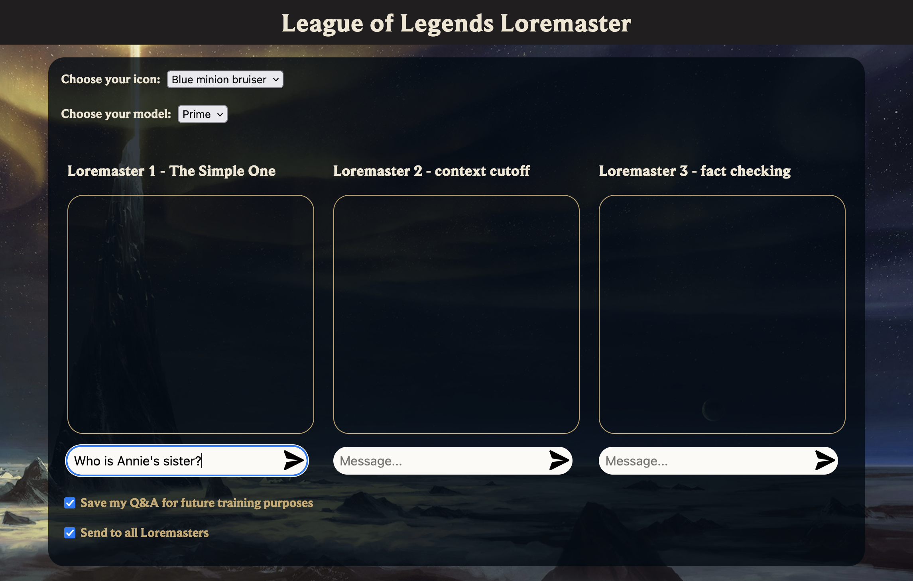
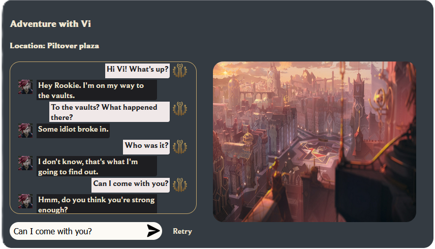
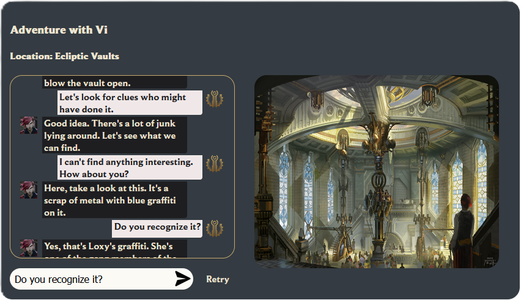

# Loremaster & Vi adventure on bedrock
The project's goal was to use AWS Bedrock to create an interactive experience for League of Legends fans. The
idea was to use GenAI to provide unique responses in a conversation that player would be having with one of the
in-game characters, Vi, or with the Loremaster - model designed to answer questions about the Runeterra
universe. Demo came with a simple web interface.

### Loremaster
Based off of universe website of League of Legends, data was scrapped and used to enginner the right prompts,
allowing user to ask questions about the Runeterra world. The Loremaster would also store a few questions to provide better follow-up.

### Vi adventure
Vi's interface came with an additional picture representing the scene where action takes place. The scene would change as the story 
that the user created completed pre-planned checkpoints. The prompt for the GPT model would also change, allowing Vi to give more appriopriate
answers given the context of the story.

